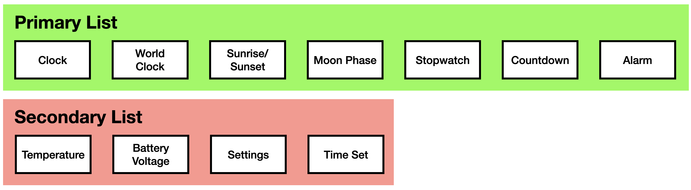

The new firmware for Sensor Watch is called Second Movement. It supersedes the old Movement firmware, but it works in largely the same way if you're familiar with it from a previous Sensor Watch iteration. If you are not familiar with it, this section will get you up to speed.

Mental Model: Two Lists of Watch Faces
--------------------------------------

In Second Movement, a **Watch Face** is a fully encapsulated block of functionality that you interact with. Your device contains two lists of watch faces that you can use: a primary list, and a secondary list. The primary list of watch faces consists of generally useful bits of information and functionality that you'll use day to day. The secondary list contains diagnostics and settings you may only need to interact with occasionally. 

You interact with watch faces using the buttons on your watch. Each button can be _pressed_, in which you push it and release, or it can be _long pressed_, in which you push and hold the button.

There are three buttons on the Casio F-91W: the MODE button, the ALARM button and the LIGHT button. While watch faces are free to use these buttons however they see fit, most watch faces adhere to a set of idioms that should make navigating your watch easy; you can expect the behavior of the buttons to be generally consistent across watch faces.

### The MODE button

A short press of the MODE button immediately moves from the current watch face to the next watch face in the list, until you reach the end of the list and wrap around. You can repeatedly press the MODE button, and you'll find yourself right back where you started.

If button beeps are enabled, each press of the MODE button will be accompanied by a low-pitch beep, except for the first watch face in the primary list — usually Clock — which gets a higher-pitched beep.

_NOTE: As a shorthand, we will refer to this first face as Clock going forward, but if you [build your own custom firmware](/docs/movement/building/), you can place any watch face first in the list._

A long press of the MODE button behaves differently whether you are on the Clock face or not. (In the next two diagrams, the short press behavior is greyed out so you can more easily see the long press behavior.)

If you are currently at the Clock face, a long press of MODE takes you to the secondary list. At that point, continued short presses will advance through the secondary list, and return you to the Clock face when you reach the end.

If you're not currently at the Clock face, a long press of MODE from anywhere else takes you back to the Clock face (accompanied by that higher-pitched beep).

### The ALARM button

The ALARM button is a general purpose button. Where appropriate, a short press of the ALARM button will take an action: on the Stopwatch face, the ALARM button starts or stops the stopwatch. On the Countdown face, it starts or stops the countdown.

For watch faces with configurable options, a long press of the ALARM button can either change those options directly, or enter a secondary mode for configuring the watch face. On the [Clock](/docs/using/clock/) face, for example, a long press of the ALARM button toggles the hourly chime, and on the [Temperature](/docs/using/temperature/) watch face it toggles metric vs imperial units (Celsius or Fahrenheit). On the [Sunrise/Sunset](/docs/using/sunrise/) watch face, a long press of the ALARM button enters the latitude / longitude settings screen; on [World Clock](/docs/using/worldclock/), it allows you to add a name and configure the time zone.

A short press of the ALARM button can also advance a value: in the [Time Set](/docs/using/timeset/) watch face, pressing Alarm while setting (say) the month, advances the month by one. Pressing it again advances it again, until you reach the final value (month 12) and it loops around.

### The LIGHT button

On most watch faces, pressing the LIGHT button illuminates the LED backlight. Holding the LIGHT button down generally keeps the LED on as long as the button is being held. This behavior is occasionally overridden though, particularly when the LIGHT button is used for other functions.

When more complex interactions call for it, the LIGHT button pulls double duty. In particular, some watch faces have different fields to navigate: when setting the time, we need a button to advance which part of the time we're setting: the hours, minutes, seconds, etc. A short press of the LIGHT button advances through these fields, wrapping around when you reach the end.

On these watch faces, you can think of the LIGHT button as a "tab" button, navigating across through columns of data, and the ALARM button as an "enter" button, changing the selected value in that column.

Watch Face Documentation
------------------------

The following pages contain documentation for each of the watch faces in the standard Second Movement firmware.
